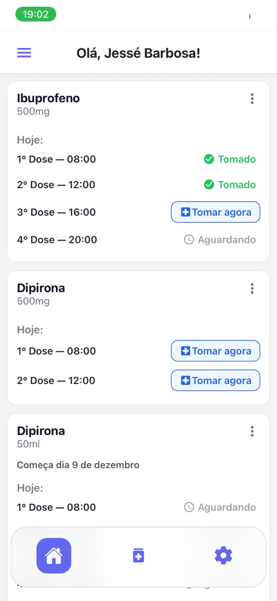
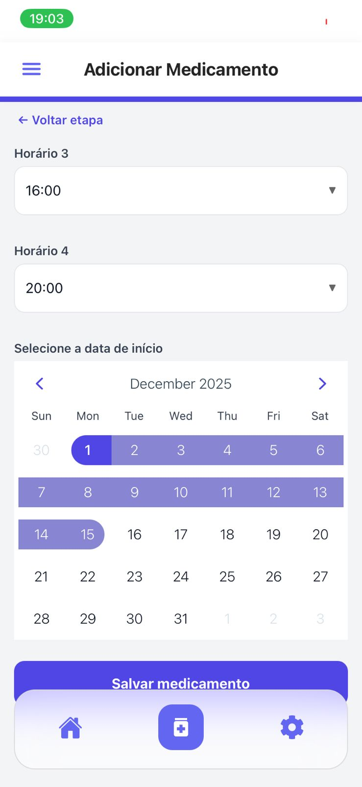

# 📱 **Dose Certa**

**Aplicativo desenvolvido com Expo + React Native para organizar medicamentos, horários e dosagens de forma simples, inteligente e prática.**
Ideal para quem precisa acompanhar rotinas de tratamento com mais segurança e menos esquecimento.

---

## ✨ **Visão Geral**

O **Dose Certa** permite que o usuário:

* 💊 Cadastre medicamentos
* ⏰ Defina horários e receba notificações
* 📅 Acompanhe o histórico de doses tomadas
* 📋 Organize rotinas de tratamento
* 🔔 Reduza esquecimentos e aumente a precisão no uso diário

---

## 🚀 **Como iniciar o projeto**

### **1. Instalar dependências**

```bash
npm install
```

### **2. Criar o arquivo `.env`**

Na raíz do projeto existe um arquivo **`.env.example`**.
Copie-o e renomeie para **`.env`**, preenchendo as variáveis necessárias:

```bash
cp .env.example .env
```

> ✨ *As variáveis inclue: a URL do banco e a chave pública anônima do projeto na supabase*

### **3. Rodar o app**

```bash
npx expo start
```

### **4. Instalar o Expo Go no celular**

* **Android:** Disponível na Google Play Store
* **iOS (iPhone):** Disponível na App Store

---

## 🛠️ **Tecnologias Utilizadas**

* **Expo**
* **React Native**
* **TypeScript**
* **JavaScript**
* **Node.js**
* **Git & GitHub**

---

## 👥 **Autores**

* Jessé Barbosa
* Lauany Ramalho
* Clarice Alves
* Joyce Fernandes
* Sara Rodrigues

---

## *Demonstração do app*

Aqui estão algumas telas do aplicativo:

<table>
  <tr>
    <td></td>
    <td></td>
  </tr>
  <tr>
    <td></td>
    <td></td>
  </tr>
</table>
